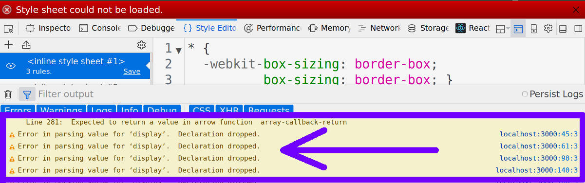
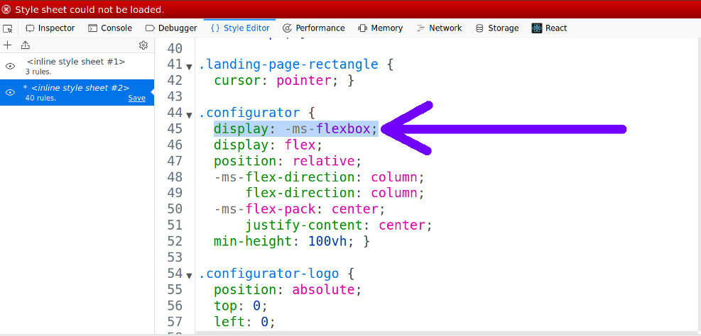

# Project FOXBAT

## Development Team
[Simon Dwyer](https://github.com/piratechicken/)

[Glenn Marks](https://github.com/isnology/)

[Nathanial Mether](https://github.com/NathanielMether/)

[Alex Palma](https://github.com/developingAlex/)

## External links
Figma wireframes ([clean](https://www.figma.com/file/EtEpPs4hyG9qDEsYVX7Kif5w/Foxbat-clean-wireframes) & [dev](https://www.figma.com/file/0tRu6eCM4M8QjqD2DJvvh8Tb/Foxbat-project))  |  [Trello task list](https://www.figma.com/file/0tRu6eCM4M8QjqD2DJvvh8Tb/Foxbat-project)  |  Google Drive for team documents | [Initial deployment on netlify](https://foxbatconfigurator.netlify.com) | [Client brief, problem/solution, minutes](https://drive.google.com/drive/folders/14T4ceIIZ0rL_E_hOnDiiVwpA2y0eomX7?usp=sharing)

## Contents
* [The Brief](#the-brief)
* [How to run](#how-to-run-in-development)
* [Tools used](#tools-used)
* [Deployment Notes](#deployment-notes)
* [Notable problems overcome during development](#notable-problems-overcome-during-development)

## The Brief
### Problem
[Foxbat Australia](http://www.foxbat.com.au/) import Aeroprakt airplanes from Europe, configure and then sell to buyers in Australia.

Their practice up to this point has involved phone call discussions between customers in Australia and then relaying their desires to the factory in Europe who then respond with an updated schematic of the custom instrument panel layout. 

This process can involve a lot of back-and-forth and takes a lot of time and so it was identified that a web app could assist by allowing the customer a platform to configure their own instrument panel and see immediate results.

### Solution
Provide a web app written with the following technologies
* Mongo
* Express
* React
* Node

## How to run in development
If you clone this (or are otherwise running for the first time on your local machine), to run it you have to:
### Install the necessary packages for frontend and backend
1. In a terminal go into the backend folder: `cd api`
1. `yarn install`
1. Now go over to the frontend folder: `cd ../web`
1. `yarn install`
### Run a mongo database server
1. Ensure that mongod service is started:
    * on Linux:
        1. Verify by executing `ps -aux | grep mongo`
        1. Start the server by executing `sudo service mongod start`
    * on MacOS:
        1. Check if it's running with `brew services list`
        1. Ensure the server is running by executing `brew services start mongod`
1. If there are any lines in the source code that look like `process.env.MONGO_URI` for example, particularly the `process.env` part, then it means some environment variables have been deployed, and they won't have been pushed to github so you won't have a copy of them. You'll have to create a file in your backend /api folder called .env (and production.env if you're to be deploying online) and here is an example of what the contents would be for dev:
    * `MONGO_URI = mongodb://localhost/foxbat`
    * `JWT_SECRET = <whatever you like here, but ensure that the value used in production is secure!!>`
    * `JWT_ALGORITHM=HS256`
    * `JWT_EXPIRESIN=7d`
### Start the backend server
1. `cd api`
1. `yarn dev`    
### Register a valid user login
As your mongo database will initially be empty, start with a user login:
1. go to the check.http file in the backend `api` folder and (in vscode there is an extension you can install called REST client for Visual Studio Code by Huachao Mao) send the request for the POST method that sends user login credentials
1. Confirm success by sending the GET request to sign-in the user you just created ( you should get a response that includes an authentication token )
1. Note that if you are going to be sending any of the other requests you find in the check.http file which require authentication you should copy the authentication token from the response you just got and replace the text that appears beside any `Authorization: Bearer` text in that file as the existing text will have been for a different developer and won't match the authentication token that your user was given.
1. If you got up to here you have your backend server up and running, as well as your mongo database, and you just sent a request to your server to write to the database followed by another to read from the database and send a result back to you.
### Seed the data necessary for the site
1. ~~In your terminal ensure you're still in the backend folder: `cd api`~~
1. ~~`yarn seed`~~

    **Update:** This is no longer necessary as the backend server will now seed itself if it finds there are no instruments in the database
### Run the frontend server
1. `cd web`
1. `yarn dev`

## Tools used
* Figma for wireframes
* Trello for task lists and user stories
* Google drive for document storage (team minutes, notes etc.)
* Slack for online team communication
* Git and Github for source code version control
* Sassy CSS (SCSS) for easier stylesheet scalability
* JWT for user authentication middleware (verification cookies)
* dotenv for development runtime environment variables
* Now from zeit.co

## Deployment Notes
We couldn't find a way to seed our database that was being hosted by mLab so decided to add some self seeding abilities to our server which were introduced in [this commit](https://github.com/isnology/project-foxbat/commit/abf427aa3d85c60b1b261718c963c527872391ab)

Another issue we had was with the backend server talking with the hosted database, and the reason was that we were failing to issue the environment variables option on every time we ran the `now` deployment command.

## Notable problems overcome during development
* Some sort of anomoly was seemingly resulting in items in our apps 'state' magically reverting to what they were prior to having been cleared.
    * The cause was identified to be the way in which the item was being set off some constant values, being an array it was an object and its elements were objects comprised of other objects, we were attempting to set our states array to be equal to the hard coded constant value instead of cloning the constants value.
* In fixing up the code, to remove all error and warning messages that appear in the browser when viewing the site, we came across a number of css warnings that declarations were being dropped:

    

    The warning messages came with a link that you can see in the above screenshot as "localhost:3000:45:3" but clicking on them didn't take you to the actual problematic line.

    To solve this we had to take a **binary search** approach and comment out all our apps css code (which in this case meant going to the main app.scss and commenting everything out there) and then selectively bring back in segments of css until the error pops up again.

    Doing this we were able to track down the exact lines which were resulting in the warnings and found it to be the result of some extra css code that was never even written by us, but was being injected into the css served up by the front end server for compatibility reasons. Viewing the right place in the browsers style editor the issue is revealed to be the -ms-flexbox value which is not understood by the Firefox browser and so was being ignored.

    

    This is what we expect to happen so in this case the warning messages are normal and to be expected.
